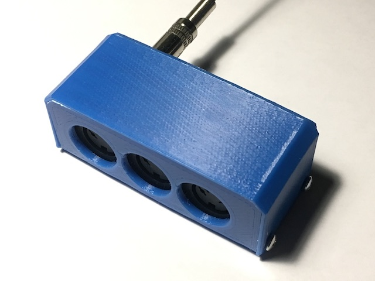
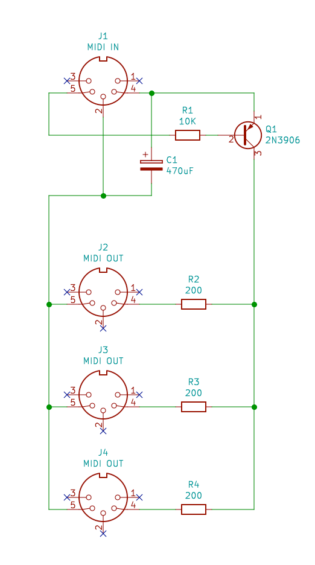
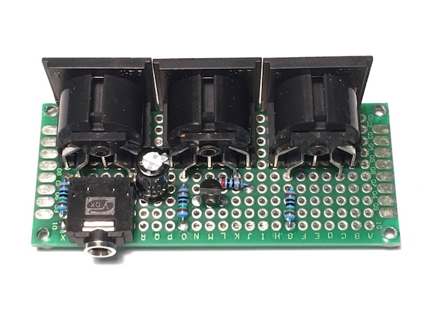
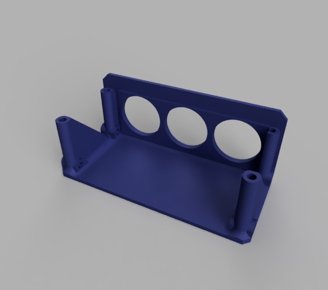

# 3Thru

Passive 3x MIDI thru box. Handy when you need to control multiple MIDI devices having no THRU ports. 
This DIY option does not require external power and needs only a couple of common parts, so it's a very easy build.

Note that since this box is powered from an incoming MIDI port it requires:

1) Your main device to provide ground as well which might be absent in some implementations. (This box itself does not do this, so you won't be able to chain multiple. The synths and sequencers I have do provide the ground and the reference MIDI circuit also mentions it.)

2) Your output device should provide enough current and/or do not send packets too frequently, so there is always enough power accumulated by the storage capacitor. (Commanding 3 synths while sending sync packets and some CCs at the same time does work in my setup.)

## Schematics

I am using DIN-5 sockets in the diagram, but it's easy to replace them with TRS sockets if your synths already use mini-jack inputs or outputs. In my prototype I actually use a TRS for input, for example. 

The power is collected by C1 connected between the ground at pin 2 and the current source at pin 4. Typical implementations appear to keep pin 4 at 5V and then switch pin 5 to ground to signal something. This way the current flows from pin 4 via an LED in an optocoupler in controlled device, and back to pin 5. We use this fact to control a simple transistor switching the current on and off accordingly for our output ports.

## Board

The prototype is made on a 30mm by 70mm stripboard, nothing special about wiring.

## Enclosure

A simple enclosure for the above mentioned 30x70mm board is designed in Fusion 360, see `3Thru.f3d` source file and `3Thru Back.stl`, `3Thru Cover.stl` for exported STLs. The design is printer-friendly, no support is needed. The board and the cover are attached with 2.5 by 9mm screws.

---
